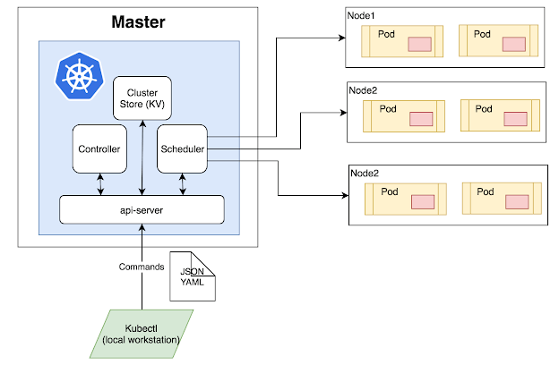
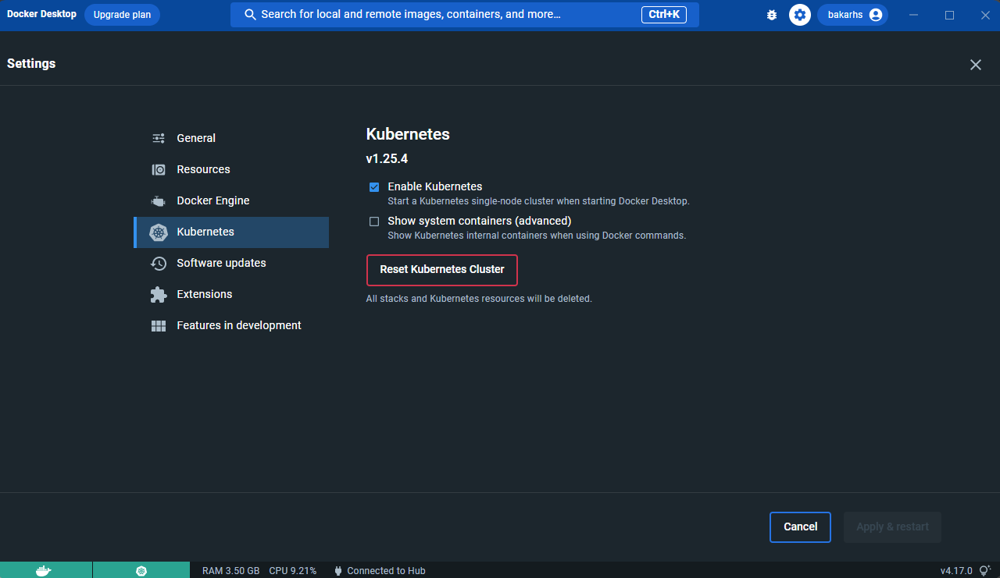
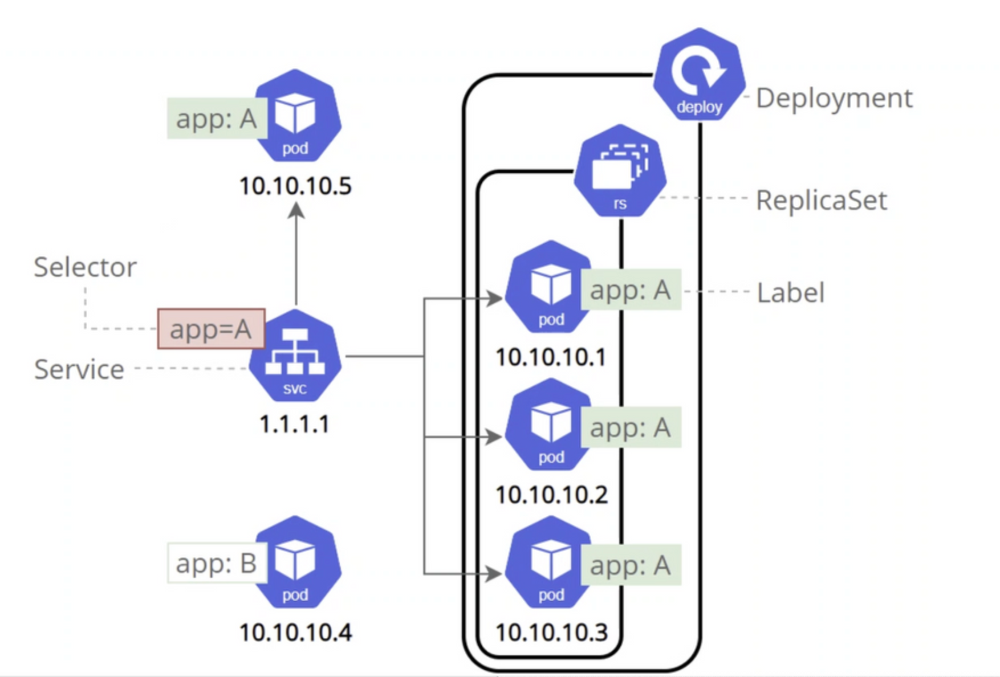

# Kubernetes (K8)
Kubernetes

- Kubernetes is an open-source platform for automating the deployment, scaling, and management of containerized applications.
- It was developed by Google and is now maintained by the Cloud Native Computing Foundation (CNCF).
- Kubernetes provides a declarative configuration for defining and deploying applications, making it easy to update and roll back changes.

## K8 Benefits
1. Scalability: Kubernetes makes it easy to scale applications up or down as demand changes, by automatically adding or removing containers.
2. Fault tolerance: Kubernetes provides built-in mechanisms for ensuring that applications continue to run even if individual containers or nodes fail.
3. Resource optimization: Kubernetes optimizes resource usage by scheduling containers based on available resources, ensuring that applications always have the resources they need to run efficiently.
4. Multi-cloud support: Kubernetes is cloud-agnostic and can be run on any cloud provider or on-premise data center.
5. Ecosystem integration: Kubernetes has a large and growing ecosystem of plugins and tools, making it easy to integrate with other popular DevOps tools and platforms.

# K8 Objects
In Kubernetes, objects are the basic building blocks used to define, configure, and manage the state of the Kubernetes cluster. These objects are represented by YAML files that define the desired state of the object, which Kubernetes uses to create, modify, or delete the object as needed.

1. Pod: The smallest and simplest unit in the Kubernetes object model, representing a single instance of a running process.

2. Deployment: A higher-level object that manages a set of identical replicas of a Pod, ensuring that the desired number of replicas are running at all times.

3. Service: An abstraction that defines a set of Pods and provides a stable network endpoint for accessing them.

4. ConfigMap and Secret: Objects used to store configuration data and sensitive information, respectively, that can be used by other Kubernetes objects.

5. StatefulSet: A higher-level object that manages stateful applications, such as databases, by providing stable network identities for each Pod in the set.

These objects can be created and managed using the Kubernetes API, command-line tools like kubectl, or through Kubernetes-specific programming languages and libraries. By using these objects, Kubernetes provides a powerful and flexible framework for managing containerized applications at scale.

# K8 Architecture

Kubernetes architecture is designed to be highly scalable, fault-tolerant, and flexible, allowing organizations to deploy and manage containerized applications at scale with ease.

The architecture of Kubernetes (K8s) consists of several components that work together to provide a platform for deploying and managing containerized applications.



- Master Node - The master node is the first and most vital component which is responsible for the management of Kubernetes cluster. It is the entry point for all kind of administrative tasks. There might be more than one master node in the cluster to check for fault tolerance.
- API Server: The API server acts as an entry point for all the REST commands used for controlling the cluster.
- Scheduler - The scheduler schedules the tasks to the slave node. It stores the resource usage information for every slave node. It is responsible for distributing the workload.It also helps you to track how the working load is used on cluster nodes. It helps you to place the workload on resources which are available and accept the workload.
- Etcd - etcd components store configuration detail and wright values. It communicates with the most component to receive commands and work. It also manages network rules and port forwarding activity.
- Worker/Slave nodes - Worker nodes are another essential component which contains all the required services to manage the networking between the containers, communicate with the master node, which allows you to assign resources to the scheduled containers.(Look above at objects)


# Installing Kubernetes

*K8 Cluster set up*

- We want to begin by installing docker hub and creating a docker hub account
https://github.com/bakarhs/docker

- Once this is done, in our settings there is a section for Kubernetes where we can now enable them (If you see Docker and K8 in green at the bottom left it should now be available):



- **Note** You may need to restart your machine

- Now in a GitBash terminal you can also check this by running :
```
kubectl get service
```

# Making our app on K8



This is the structure we aim to replicate

This link will help with the many K8 commands

https://kubernetes.io/docs/reference/kubectl/cheatsheet/

Main commands needed:

```commandline
kubectl create -f <name of file.yml>
kubectl delete deployment <name of deployment>
kubectl edit deploy <deployfilename>.yml
kubectl get pods
kubectl get delpoy
kubectl get service #or kubectl get svc
kubectl describe <name.yml>

```
- We need to create YAML files for both deployment and service of each application
- *Note* create in a specific order nginx-> mongo -> sparta-app

nginx-deployment.yml:
```yaml
apiVersion: apps/v1
kind: Deployment

metadata:
  name: nginx-deployment

spec:
  selector:
    matchLabels:
      app: nginx
  replicas: 3
  template:
    metadata:
      labels:
        app: nginx
    spec:
      containers:
        - name: nginx
          image: bakarhs/nginx-tech201:v1

          ports:
            - containerPort: 80
          imagePullPolicy: Always
```

nginx-service.yml:
```yaml
apiVersion: v1
kind: Service
metadata:
  name: nginx
  namespace: default
spec:
  ports:
  - nodePort: 30001
    port: 80

    targetPort: 80
  selector:
    app: nginx
  type: NodePort
```

app-deployment.yml
```yaml
apiVersion: apps/v1

kind: Deployment

metadata:
  name: sparta-app
spec:
  selector:
    matchLabels:
      app: sparta-app
  replicas: 3
  template:
    metadata:
      labels:
        app: sparta-app
    spec:
      containers:
        - name: sparta-app
          image: bakarhs/sparta-app:v2

          env:
            - name: DB_HOST
              value: mongodb://mongo:27017/dev

          ports:
            - containerPort: 3000
          imagePullPolicy: Always
```

app-service.yml
```yaml
apiVersion: v1
kind: Service
metadata:
  name: sparta-app
  namespace: default
spec:
  ports:
  - nodePort: 30002
    port: 80
    protocol: TCP
    targetPort: 3000
  selector:
    app: sparta-app
  type: NodePort
```

mongo-deployment:
```yaml
apiVersion: v1
kind: PersistentVolumeClaim
metadata:
  name: mongo-pvc
spec:
  accessModes:
    - ReadWriteOnce
  resources:
    requests:
      storage: 256Mi

---
apiVersion: apps/v1
kind: Deployment
metadata:
  name: mongo
spec:
  selector:
    matchLabels:
      app: mongo
  replicas: 1
  template:
    metadata:
      labels:
        app: mongo
    spec:
      containers:
        - name: mongo
          image: bakarhs/mongo:v2
          ports:
            - containerPort: 27017
          volumeMounts:
            - name: storage
              mountPath: /data/db
      volumes:
        - name: storage
          persistentVolumeClaim:
            claimName: mongo-pvc
```

mongo-service.yml:
```yaml
apiVersion: v1
kind: Service
metadata:
  name: mongo
spec:
  selector:
    app: mongo
  ports:
    - port: 27017
      targetPort: 27017
```


